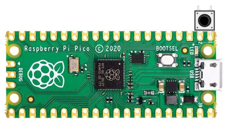

# Bad-pico

a [USB-RubberDucky](https://shop.hak5.org/products/usb-rubber-ducky-deluxe) clone.

---

### Installation :

- Plug in your pico.
- Download [CircuitPython](https://downloads.circuitpython.org/bin/raspberry_pi_pico/en_US/adafruit-circuitpython-raspberry_pi_pico-en_US-6.3.0.uf2)
- Copy the UF2 file into pico
- clone the installer
```bash
git clone https://github.com/polarspetroll/bad_pico.git
cd bad_pico
chmod +x install.sh
sudo ./install.sh
```
 - before you install the script on pico, make sure to add some commands in ```commands.txt```. The content of this file are codes that will execute on target's computer.
 ---

###### Kill switch
<br/>
<div align="center"></div>
<br/>
This push button acts as a kill switch. Hold this button before plugging in the board for about 3 seconds. If the led turned on , it means that the program stopped.


> ⚠ currently only linux/unix based operating systems are supported for the script.
